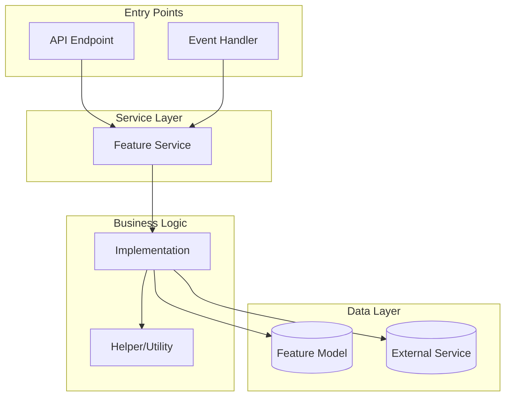

# Output Template

This template shows the Markdown structure used for the **final combined output** — a single code block produced at the end of Phase 4 containing all three deliverables (Business Rules, Architecture, Test Plan).

> **During the workflow** (Phases 1-4), all output is presented as normal rendered Markdown. Mermaid diagrams are rendered visually when the environment supports it. This template is used **only** for the final combined code block.

---

## Template Structure (Markdown)

The final combined output uses a **4-backtick fence** so inner fenced blocks (like `` ```mermaid ``) nest correctly. The sections below show the content inside that fence.

### Section Order

1. Business Rules Analysis
2. Architecture
3. Test Plan

```markdown
## Business Rules Analysis

| Rule # | Business Rule | Source | Hook Point? | Existing Pattern? |
|--------|---------------|--------|-------------|-------------------|
| 1 | [Rule description] | Requirements | [Hook] | [Yes/No] |
| 2 | [Rule description] | Code | [Hook] | [Yes/No] |

**Technical Domains:** [list]
**Reference Guidance:** [summary]

---

## Architecture

### Component Overview

| Type | Name | Responsibility | Key Interactions |
|------|------|----------------|------------------|
| Module | [Name] | [Core logic] | [Dependencies] |
| Service | [Name] Impl | [Business logic] | [Events raised/consumed] |
| Controller | [Name] Controller | [API layer] | [Routes, validation] |
| Model | [Name] | [Data persistence] | [Relations, migrations] |
| Middleware | [Name] | [Cross-cutting] | [Pipeline position] |

### Pattern Applied

| Pattern | Where | Purpose |
|---------|-------|---------|
| Facade | Main service | Single entry point, hides implementation |
| Repository | Data layer | Abstracts storage, enables testing |
| Strategy | Business logic | Swappable algorithms for different contexts |

### Architecture Diagram



### Design Decisions

| Decision | Choice | Rationale |
|----------|--------|-----------|
| API Design | RESTful | Consistent with existing endpoints |
| Error Handling | Result pattern | Explicit error propagation, no exceptions |
| Data Access | Repository pattern | Testable, swappable backends |
| Authentication | Middleware | Consistent with existing auth flow |
| Caching | None initially | Premature optimization; add if profiling shows need |

---

## Test Plan

### Scope

- **Feature**: [Feature Name]
- **Environment**: [Dev/Staging/Sandbox]
- **Type**: [Manual / Automated / Mixed]

### Checklist

- [ ] [Key validation or flow]
- [ ] [Key data processing or calculation]
- [ ] [Permissions/authorization]

### Scenario Inventory

| # | Scenario | Type | Risk | Preconditions | Evidence |
|---|----------|------|------|---------------|----------|
| 1 | [Happy path description] | Auto | Low | [Setup summary] | [Expected output] |
| 2 | [Edge case description] | Auto | Med | [Setup summary] | [Error response] |

### Scenarios

#### Scenario 1: [Happy Path Name]

- **Rule(s)**: R1
- **Preconditions**: [Setup data and environment]
- **Steps**:
  1. [Action taken]
  2. [Additional action]
  3. [Verification step]
- **Expected Results**: [Expected outcome]
- **Evidence**: [Output, response, state change]

#### Scenario 2: [Error Case Name]

- **Rule(s)**: R2
- **Preconditions**: [Invalid setup or missing data]
- **Steps**:
  1. [Action that should fail]
  2. [Verification step]
- **Expected Results**: [Error message or rejection]
- **Evidence**: [Error response, log entry]
```

---

## Tips

1. **Keep sections in order** — Business Rules, then Architecture, then Test Plan
2. **Use Markdown tables** — Portable across work tracking tools
3. **Naming conventions** — Follow the project's existing naming patterns
4. **Design decisions** — Always include rationale, not just the choice
5. **Test steps** — Keep steps explicit and evidence targets clear
6. **Mermaid diagrams** — In the final code block, use fenced `` ```mermaid `` blocks. During the workflow, render visually when the environment supports it; otherwise use fenced code blocks
7. **Single code block** — Only the final combined output at the end of Phase 4 uses a code block fence
