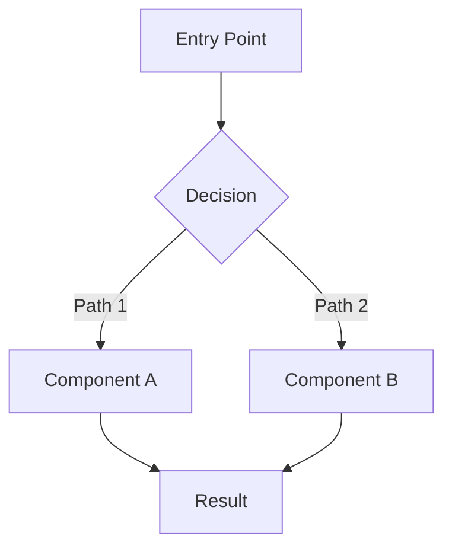

# PR Description Template

This template serves as the persistent state for the TDD implementation workflow. Each section is populated as phases complete. The PR description is the source of truth — it enables resuming from any point.

---

## Template

```markdown
## Summary

[Brief description of the feature being implemented]
Closes #{issue-number} (if applicable)

---

## Architecture

### Component Overview

| Type | Name | Responsibility | Key Interactions |
|------|------|----------------|------------------|
| [Module/Service/Class] | [Name] | [What it does] | [Dependencies/events] |
| ... | ... | ... | ... |

### Architecture Diagram



### Design Decisions

| Decision | Choice | Rationale |
|----------|--------|-----------|
| [Decision] | [What was chosen] | [Why] |

---

## Test Plan

### Scenario Inventory

| # | ZOMBIES | Scenario | Type | Risk |
|---|---------|----------|------|------|
| 1 | Z - Zero | [Empty/null case] | Unit | Low |
| 2 | O - One | [Happy path] | Unit | Low |
| 3 | M - Many | [Multiple items] | Unit | Medium |
| 4 | B - Boundary | [Edge case] | Unit | Medium |
| 5 | E - Exception | [Error case] | Unit | High |

### Rule to Scenario Traceability

| Rule # | Business Rule | Scenarios | Notes |
|--------|---------------|-----------|-------|
| 1 | [Rule from planning] | 1, 2 | Core behavior |
| 2 | [Another rule] | 3 | Error handling |

### Scenarios

#### Scenario 1: [Name]

- **Rule(s)**: #1
- **Given**: [Preconditions]
- **When**: [Action]
- **Then**: [Expected outcome]

---

## Implementation Progress

| # | Scenario | Red | Green | Refactor | Status |
|---|----------|-----|-------|----------|--------|
| 1 | [Scenario 1] | [ ] | [ ] | [ ] | Not started |
| 2 | [Scenario 2] | [ ] | [ ] | [ ] | Not started |
| 3 | [Scenario 3] | [ ] | [ ] | [ ] | Not started |

### Progress Notes

_Updated as implementation proceeds_

---

## Review Checklist

- [ ] All scenarios passing
- [ ] No debug/temporary artifacts in codebase
- [ ] Code review comments addressed
- [ ] Build/CI passing
- [ ] Ready for merge
```

---

## Section Purposes

| Section | Purpose | Written In |
|---------|---------|------------|
| **Summary** | Links PR to work item, brief description | Phase 1 |
| **Architecture** | Design decisions, component breakdown | Phase 1 (copied from planning) |
| **Test Plan** | Complete specification of what will be tested | Phase 1 (copied from planning) |
| **Implementation Progress** | Real-time tracking of TDD cycle | Phase 2 (updated throughout) |
| **Review Checklist** | Final verification before merge | Phase 3 |

## Progress Table States

| Red | Green | Refactor | Status |
|-----|-------|----------|--------|
| [ ] | [ ] | [ ] | Not started |
| [x] | [ ] | [ ] | In progress (test failing) |
| [x] | [x] | [ ] | In progress (test passing) |
| [x] | [x] | [x] | Complete |

## Tips

1. **Keep sections in order** — resume logic depends on section presence
2. **Use exact checkbox syntax** — `[ ]` for unchecked, `[x]` for checked
3. **Update progress atomically** — mark checkbox immediately after completing phase
4. **Document blockers** — note them in the Status column
